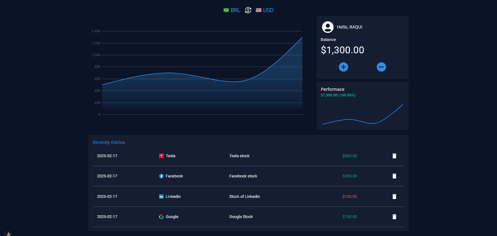
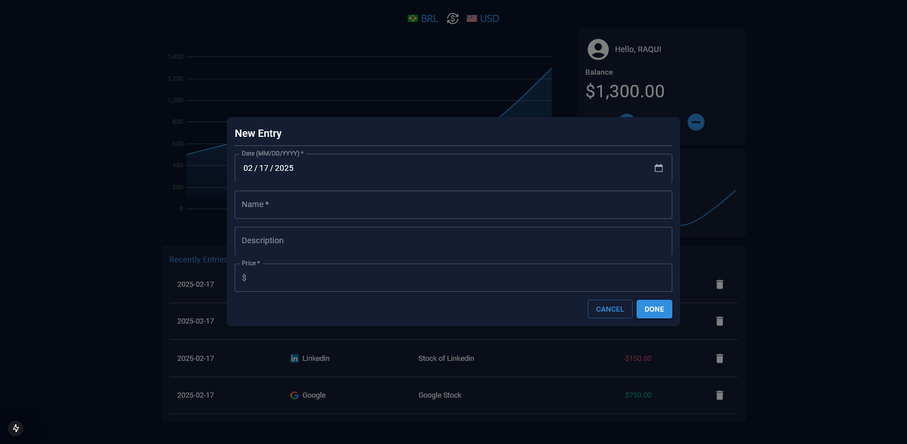

# Finance Dashboard

**Finance Bashboard** is a management system built with Nest.js and Next.js. This project demonstrates proficiency in both backend and frontend development, containerization, and deployment practices.

> This project is a work in progress. New features and improvements are continuously being developed.

---

## Features

- Built with modern frameworks: **NestJS** for backend and **Next.js** for frontend.
- Written entirely in **TypeScript** for type safety and maintainability.
- Scalable and modular architecture for future enhancements.

---

## Technologies Used

### Backend:

- **Nest.js**: A progressive Node.js framework for building efficient and scalable server-side applications.
- **PostgreSQL**: Used for database management due to its reliability and scalability.
- **Prisma**: Simplifies database integration, providing a robust and easy-to-use API for data operations.

### Frontend:

- **Next.js**: A React framework for production-grade web applications.
- **Material UI**: Customizable components, following Google's Material Design guidelines for rapid UI development.
- **Emotion**: A library for writing CSS styles with JavaScript, providing powerful tools for styling React components.
- **Redux**: For state management to maintain a predictable and centralized state across the application.
  
### Tools and Infrastructure (DevOps):

    
- **Docker**: For containerization of the application.
- **Docker Compose**: For managing multi-container applications.
- **Git**: Version control system.
- - **Jest**: For unit and integration testing.
